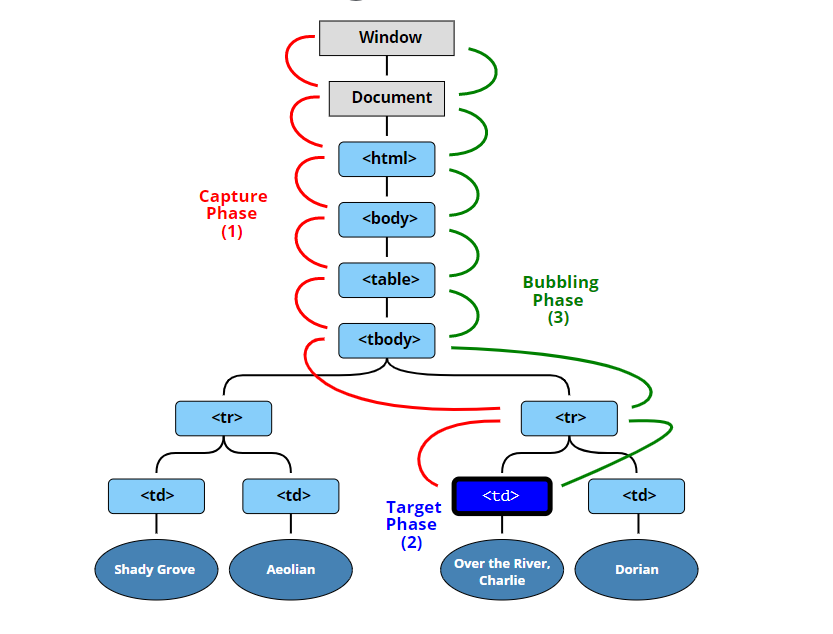

# Day 25 Challenge: Event Capture, Propagation, Bubbling and Once

#### Live Site URL: https://basuabhirup.github.io/js30-day-25-event-capture/

This is the project for the Day 25 of the 30-days vanilla JavaScript coding challenge from https://javascript30.com/

This project doesn't have any front-end stuffs. Checkout the browser's JavaScript console to see the results.

### Event propagation
The standard DOM Events describes 3 phases of event propagation:
- 1. Capturing phase – the event goes down to the element.
- 2. Target phase – the event reached the target element.
- 3. Bubbling phase – the event bubbles up from the element.

To know more, [visit this page](https://javascript.info/bubbling-and-capturing)
